  <a href="https://thippeswamykr1204.github.io/Portfolio">Portfolio</a> ·
  <a href="mailto:kollithippeswamy1204@gmail.com">Email</a> ·
  <a href="https://linkedin.com/in/thippeswamy-kr">LinkedIn</a>

### 👨‍💻 About Me

- 🎓 B.E. in Artificial Intelligence & Machine Learning (2026)
- 💻 Full Stack Developer — React, Next.js, Node.js, PostgreSQL
- 🏗️ Shipped 4 production-style full-stack apps with test coverage, auth, and cloud deployment
- 📍 Bengaluru, India
- 💼 Open to Full Stack Developer & Software Engineer roles

### 🚀 Currently Building

- Working through a 60-day structured MERN/DSA interview prep roadmap
- Deepening System Design and Data Structures & Algorithms
- Exploring Docker, AWS, and deployment workflows

### 🛠️ Tech Stack

**Languages**
 

**Frontend**
 

**Backend**
 

**Databases**
 

**Cloud, DevOps & Tools**
 

**Testing**
 

### 🚀 Featured Projects

<table>
<tr>
<td width="50%" valign="top">

**🧭 [Yatrik — AI Travel Planner](https://github.com/Thippeswamykr1204/Yatrick)**

`Next.js 15` `TypeScript` `Gemini API` `MongoDB Atlas`

Full-stack AI travel planner — 6-screen user flow, 5 Gemini-powered endpoints including **Smart Day Regeneration** (rebuild a single itinerary day in isolation). All routes secured with JWT + bcrypt + ownership-based authorization.

🔗 [Live Demo](https://yatrick.vercel.app)

</td>
<td width="50%" valign="top">

**💰 [FinSight — Finance Tracker](https://github.com/Thippeswamykr1204/FinSight)**

`Next.js 14` `Prisma` `PostgreSQL` `Redis`

Dashboard-driven finance app — 9 REST endpoints, composite-key duplicate detection on CSV ingest, and a **3-tier Redis TTL cache** that degrades gracefully under outages.

🔗 [Live Demo](https://finsight-five-delta.vercel.app)

</td>
</tr>
<tr>
<td width="50%" valign="top">

**🏥 [PulseQ — Real-Time Queue System](https://github.com/Thippeswamykr1204/PluseQ)**

`MERN` `Socket.io` `JWT` `Jest`

Real-time hospital queue manager — 18 REST endpoints, **Socket.io room-based events** for live token updates, race-condition-safe atomic MongoDB operations, validated by a 21-test Jest/Supertest suite.

🔗 [Live Demo](https://pluse-q.vercel.app)

</td>
<td width="50%" valign="top">

**📊 [ImportCSV Pro — AI CSV Importer](https://github.com/Thippeswamykr1204/ImportCSV-Pro)**

`Next.js` `Zod` `Gemini API` `SSE`

Enterprise CSV importer mapping 5 CRM/ad platforms into a fixed schema — JSON repair pipeline, exponential-backoff retries, 4-way parallel batching, validated by a 63-test Vitest suite.

</td>
</tr>
</table>

### 💼 Experience

**Full-Stack Web Development Intern** · SuprMentr Technologies Pvt Ltd
*Feb 2026 – May 2026*

- Owned end-to-end development of FinSight — from schema design to production deployment
- Shipped responsive full-stack features in sprint-based Agile cycles
- Collaborated with cross-functional teams to ship production-ready code on schedule

### 📈 GitHub Stats

<!-- 🐍 Contribution snake — auto-generated by .github/workflows/snake.yml, updates daily, unique & self-owned -->

### 🎓 Education

**B.E. — Artificial Intelligence & Machine Learning**
Sri Sairam College of Engineering, Anekal (VTU)
CGPA 7.81/10 · 2022 – 2026

### 📫 Let's Build Something

